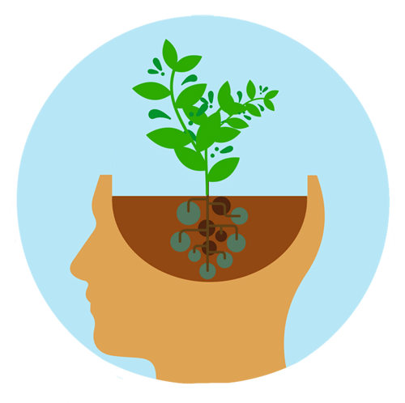

**Name:** Aseel Fawwaz Al-Saqer

# \*Growth Mindset\*
## What Is The Growth Mindset?
**A Growth Mindset** believes that one's fundamental abilties can be developed through perseverance and effort :muscle:.\
This Table Shows some differnce between Growth and Fixed Mindset:
**Growth Mindset** | **Fixed Mindset**
------------------ | -----------------
Embraces challenges| Avoid challenges
Persists obstacels | Loses focus obstacle

At the end a Growth Mindset opens you up to more creativity and possibility, and I'm sure you will find out that you are able to achieve more than you imagined.
For more information [Growth Mindsrt](https://docs.github.com/en/github/writing-on-github/getting-started-with-writing-and-formatting-on-github/basic-writing-and-formatting-syntax)

3 Ways to develop my Growth Mindset:\
- Acknowledge and embrace imperfections. \(Hiding from my weaknesses means I’ll never overcome them\).
- Try different learning tactics.
- Replace the word “failing” with the word “learning.” \(When I make a mistake or fall short of a goal, I haven’t failed; I’ve learned\).
