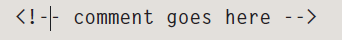

# HTML 

  
The **HTML** code (in blue) is made up of characters that live inside angled
brackets — these are called HTML **elements** . Elements are usually
made up of two **tags** : an opening tag and a closing tag. (The closing tag
has an extra forward slash in it.) Each HTML element tells the browser
something about the information that sits between its opening and
closing tags.

* HTML Uses Elements to Describe the Structure of Pages.

* Tags act like containers. They tell you something about the information that lies between their opening and closing tags.

* Attributes provide additional information about the contents of an element. They appear on the opening tag of the element and are made up of two parts: a name and a value,
separated by an equals sign. 

* DOCTYPE declaration to tell a browser which version of HTML the page is using.

 
 
* comments are not visible to users in the main browser window, they can be viewed by anyone who looks at the source code behind the page.

* Escape characters are used to include special characters in your pages such as <, >, and ©.

## HTML5:
1. The new HTML5 elements i XX ndicate the purpose of different parts of a web page and help to describe its structure.
2. The new elements provide clearer code (compared with using multiple 
 elements).
 
 
 
 
 
