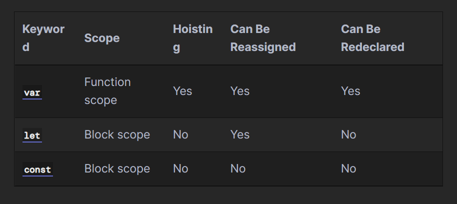
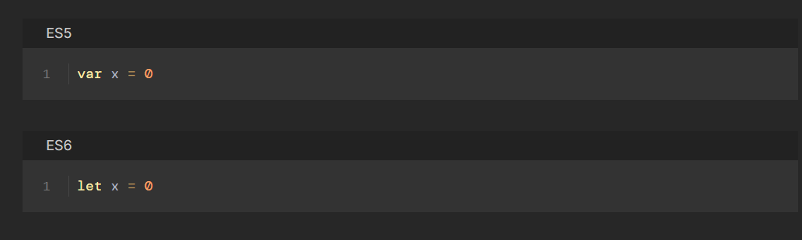
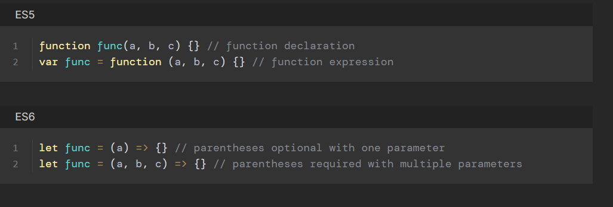

## Variables and constant feature comparison:

## Variable declaration:
- ES6 introduced the let keyword, which allows for block-scoped variables which cannot be hoisted or redeclared.

## Constant declaration:
- ES6 introduced the const keyword, which cannot be redeclared or reassigned, but is not immutable.

## Arrow functions

## Multi-line strings
Using template literal syntax, a JavaScript string can span multiple lines without the need for concatenation.

## Implicit returns
The return keyword is implied and can be omitted if using arrow functions without a block body.
# React : 
Instead of artificially separating technologies by putting markup and logic in separate files, React separates concerns with loosely coupled units called “components” that contain both. We will come back to components in a further section, but if you’re not yet comfortable putting markup in JS, this talk might convince you otherwise.

React doesn’t require using JSX, but most people find it helpful as a visual aid when working with UI inside the JavaScript code. It also allows React to show more useful error and warning messages.
- You can put any valid JavaScript expression inside the curly braces in JSX. For example, 2 + 2, user.firstName, or formatName(user) are all valid JavaScript expressions.
- This means that you can use JSX inside of if statements and for loops, assign it to variables, accept it as arguments, and return it from functions:
- Specifying Attributes with JSX
- JSX tags may contain children
- By default, React DOM escapes any values embedded in JSX before rendering them.
- React.createElement() performs a few checks to help you write bug-free code but essentially it creates an object
### Rendering Elements:
- An element describes what you want to see on the screen
- React elements are immutable. Once you create an element, you can’t change its children or attributes
- React DOM compares the element and its children to the previous one, and only applies the DOM updates necessary to bring the DOM to the desired state.
### Components and Props:
- Components can refer to other components in their output. This lets us use the same component abstraction for any level of detail. A button, a form, a dialog, a screen: in React apps, all those are commonly expressed as components.

##### Converting a Function to a Class
You can convert a function component like Clock to a class in five steps:

- Create an ES6 class, with the same name, that extends React.Component.
- Add a single empty method to it called render().
- Move the body of the function into the render() method.
- Replace props with this.props in the render() body.
- Delete the remaining empty function declaration.

-Replace this.props.date with this.state.date in the render() method 

### Handling Events
React events are named using camelCase, rather than lowercase.
With JSX you pass a function as the event handler, rather than a string.

## Tailwind CSS:

#### Some CCS:
- Tailwind’s flexbox and padding utilities (flex, flex-shrink-0, and p-6) to control the overall card layout
- The max-width and margin utilities (max-w-sm and mx-auto) to constrain the card width and center it horizontally
- The background color, border radius, and box-shadow utilities (bg-white, rounded-xl, and shadow-md) to style the card’s appearance
- The width and height utilities (w-12 and h-12) to size the logo image
- The space-between utilities (space-x-4) to handle the spacing between the logo and the text
- The font size, text color, and font-weight utilities (text-xl, text-black, font-medium, etc.) to style the card text
##### using utility classes has a few important advantages over inline styles:

- Designing with constraints. Using inline styles, every value is a magic number. With utilities, you’re choosing styles from a predefined design system, which makes it much easier to build visually consistent UIs.
- Responsive design. You can’t use media queries in inline styles, but you can use Tailwind’s responsive utilities to build fully responsive interfaces easily.
- Hover, focus, and other states. Inline styles can’t target states like hover or focus, but Tailwind’s state variants make it easy to style those states with utility classes.

## Next.js App:
To build a complete web application with React from scratch, there are many important details you need to consider:

- Code has to be bundled using a bundler like webpack and transformed using a compiler like Babel.
- You need to do production optimizations such as code splitting.
- You might want to statically pre-render some pages for performance and SEO. You might also want to use server-side rendering or client-side rendering.
- You might have to write some server-side code to connect your React app to your data store.
#### Next.js: The React Framework
Next.js aims to have best-in-class developer experience and many built-in features, such as:

- An intuitive page-based routing system (with support for dynamic routes)
- Pre-rendering, both static generation (SSG) and server-side rendering (SSR) are supported on a per-page basis
- Automatic code splitting for faster page loads
- Client-side routing with optimized prefetching
- Built-in CSS and Sass support, and support for any CSS-in-JS library
- Development environment with Fast Refresh support
- API routes to build API endpoints with Serverless Functions
- Fully extendable
#### Create a Next.js app :
npx create-next-app nextjs-blog --use-npm 
#### Run the development server :
- cd nextjs-blog
- npm run dev
#### Welcome to Next.js
#### Editing the Page
- editing the starter page.

- Make sure the Next.js development server is still running.
- Open pages/index.js with your text editor.
- Find the text that says “Welcome to” under the < h1> tag and change it to “Learn”.
- Save the file.

