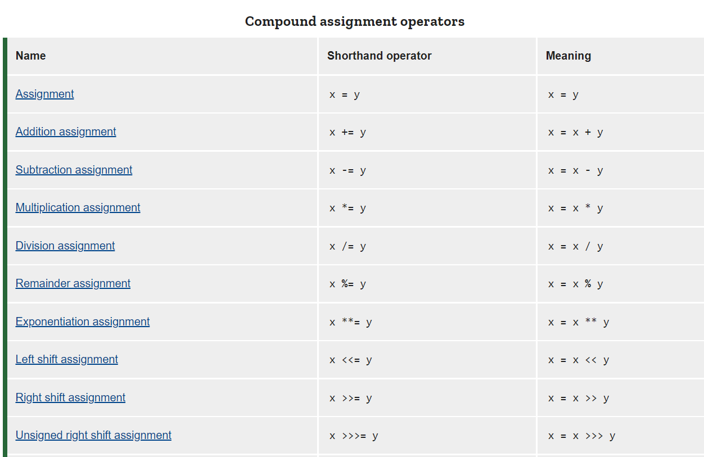
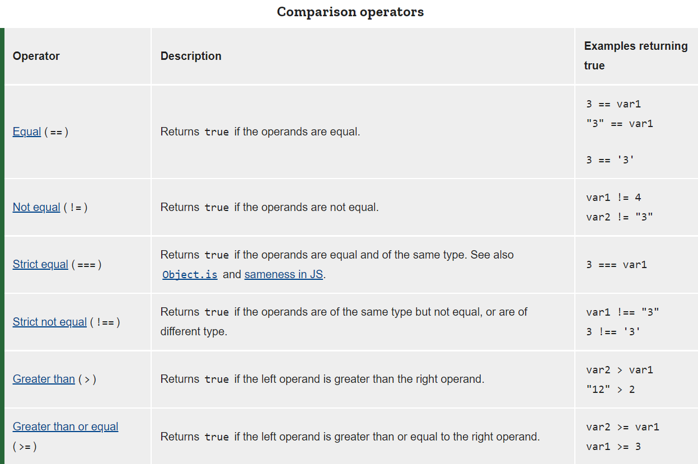
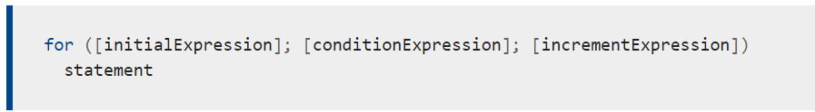
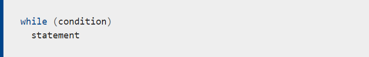

# Operators 
\

## Loops
* loops are used for a repeated action.
* A **for**  loop repeats until a specified condition evaluates to false.

* A **while** statement executes its statements as long as a specified condition evaluates to true.

