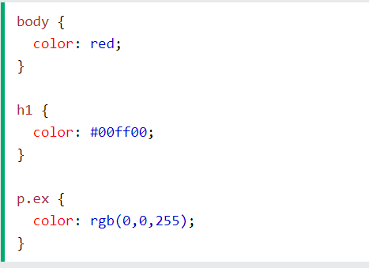

# CSS
**CSS**  *(Cascading Style Sheets)* ,is a language for specifying how documents are presented to users — how they are styled.\
* Three Ways to Insert CSS:
1. External CSS
    * Each HTML page must include a reference to the external style sheet file inside the <link> element, inside the head section.
    * An external style sheet can be written in any text editor, and must be saved with a .css extension. 
    * The external .css file should not contain any HTML tags.
2. Internal CSS:
    * The internal style is defined inside the <style> element, inside the head section.
3. Inline CSS:
    * To use inline styles, add the style attribute to the relevant element. The style attribute can contain any CSS property.

 * Adding color:
   
 
   
